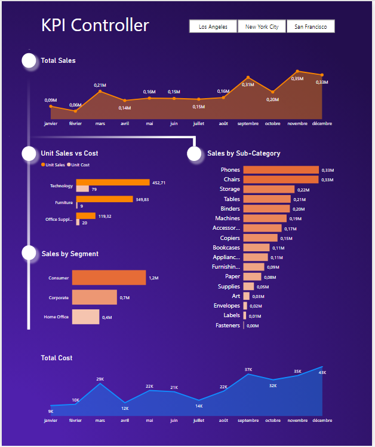

# Projet-Power-BI

### Sales Report – Tableau de bord Power BI
Ce rapport Power BI a été conçu pour fournir une vue d’ensemble claire et interactive des performances commerciales d’une entreprise. Il regroupe des indicateurs clés tels que le chiffre d’affaires total, le nombre de produits vendus et de clients, ainsi que l’évolution des ventes au fil du temps.
Grâce à des visualisations variées (graphiques linéaires, histogrammes, camemberts, cartes géographiques), le tableau de bord permet d’analyser :

- Les ventes mensuelles
- Les profits par catégorie de produits
- Les performances par région et par ville
- La comparaison entre ventes et profits
- La rentabilité par type de produit et période

Ce rapport a pour objectif d’aider les décideurs à suivre les résultats, identifier les tendances, détecter les écarts et orienter les actions stratégiques grâce à une lecture visuelle rapide et pertinente des données commerciales.

|                        Sales Analysis Report                        |
| --------------------------------------------------------------------|
|                                           |

|         Sales Report 2020        |        Sales Report 2021         |
| -------------------------------- | -------------------------------- |
|    |    |

### KPI Controller
Ce tableau de bord interactif, intitulé KPI Controller, permet de visualiser de manière synthétique et dynamique les principaux indicateurs de performance liés aux ventes et aux coûts. Il est conçu pour suivre les performances commerciales dans trois villes (Los Angeles, New York City, San Francisco), avec des filtres activables en haut de l’interface.
|                                                                                                                     |                                                                |
| Les sections clés incluent :                                                                                        |                                                                                         |
|                                                                                                                     |                                                                                         |
|- Total Sales (Ventes totales) : Un graphique linéaire illustre l’évolution mensuelle des ventes,                    |                                                                                         |
|  culminant en novembre et décembre.                                                                                 |                                                                                         |
|- Unit Sales vs Cost : Un histogramme comparatif affiche le nombre d’unités vendues et le coût unitaire moyen        |                                                                                         |
|  pour trois catégories principales : Technologie, Mobilier et Fournitures de bureau.                                |                                                                                         |
|- Sales by Segment : Une visualisation horizontale montre la répartition des ventes selon trois                      |                                                                                         |
|  segments : Consommateur, Entreprise (Corporate) et Bureaux à domicile (Home Office).                               |                                                                                         |
|- Sales by Sub-Category : Cette section détaille les ventes par sous-catégorie de produit.                           |                                                                                         |
|  Les téléphones et les chaises sont les meilleures ventes.                                                          |                                                                                         |
|- Total Cost (Coût total) : Un graphique en courbes présente les coûts mensuels, avec un pic                         |                                                                                         |
|  notable en septembre et décembre.                                                                                  |                                                                                         |
|                                                                                                                     |                                                                                         |
|Ce tableau de bord facilite une analyse rapide, visuelle et comparative des performances commerciales, permettant    |                                                                                         |
|aux décideurs d’identifier les tendances, les produits performants, et les axes d’amélioration.                      |                                                                                         |
                                                                                         
