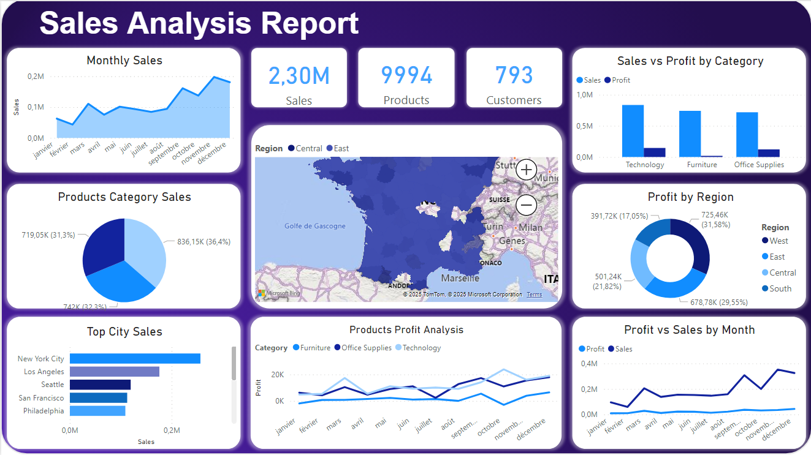
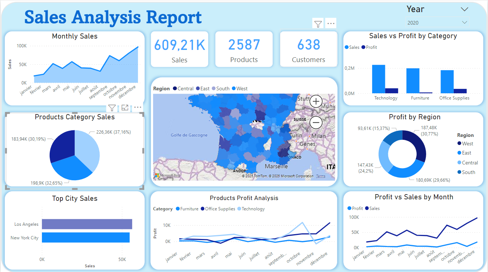

# Projet-Power-BI

### Sales Report – Tableau de bord Power BI
Ce rapport Power BI a été conçu pour fournir une vue d’ensemble claire et interactive des performances commerciales d’une entreprise. Il regroupe des indicateurs clés tels que le chiffre d’affaires total, le nombre de produits vendus et de clients, ainsi que l’évolution des ventes au fil du temps.
Grâce à des visualisations variées (graphiques linéaires, histogrammes, camemberts, cartes géographiques), le tableau de bord permet d’analyser :

- Les ventes mensuelles
- Les profits par catégorie de produits
- Les performances par région et par ville
- La comparaison entre ventes et profits
- La rentabilité par type de produit et période

Ce rapport a pour objectif d’aider les décideurs à suivre les résultats, identifier les tendances, détecter les écarts et orienter les actions stratégiques grâce à une lecture visuelle rapide et pertinente des données commerciales.

|                        Sales Analysis Report                        |
| --------------------------------------------------------------------|
|                                           |

|         Sales Report 2020        |        Sales Report 2021         |
| -------------------------------- | -------------------------------- |
|    |    |

